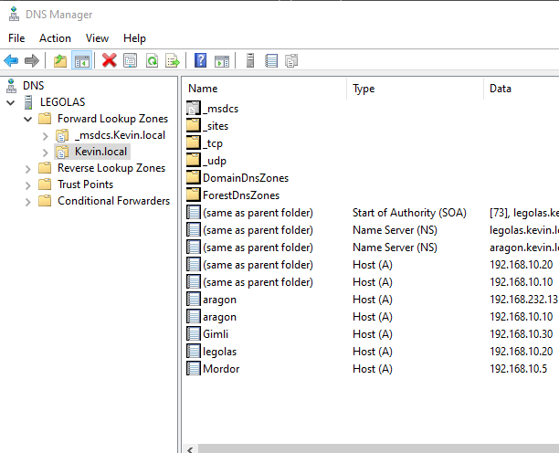
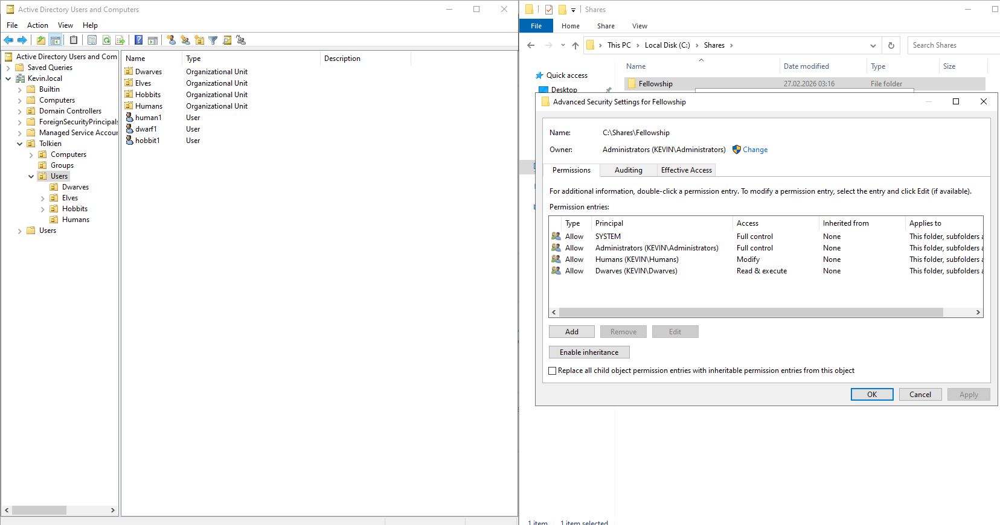
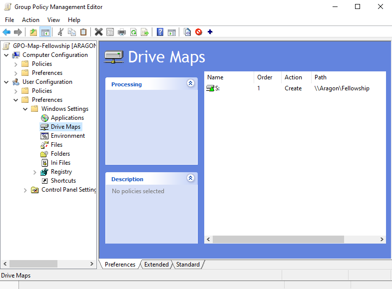
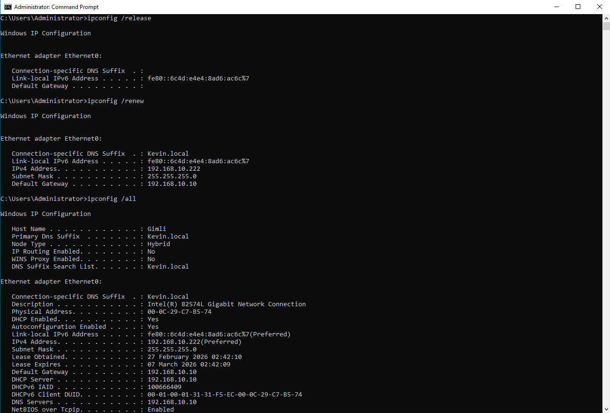

# 🖥️ Enterprise Infrastructure Lab

This project demonstrates a complete on-prem enterprise infrastructure setup using Windows Server.

---

## 📌 Overview

In this lab, I configured:

* Active Directory Domain Services (AD DS)
* DNS & DHCP
* Group Policy (Drive Mapping)
* NTFS Permissions & File Shares
* Client configuration & IP management

---

## 🧠 Environment

* Domain: `Kevin.local`
* Servers:

  * Aragon (Domain Controller, DHCP)
  * Legolas (DNS)
* Clients:

  * Gimli
  * Others (domain joined)

---

## 🌐 DHCP Configuration

Configured a DHCP scope for automatic IP assignment.

---

## 🌍 DNS Configuration

Created and verified DNS records for all hosts.

---

## 📂 File Share & Permissions

Configured NTFS permissions based on groups:

* Humans → Modify
* Dwarves → Read

---

## 🔗 Drive Mapping (GPO)

Mapped shared folder automatically using Group Policy.

---

## 💻 Client Verification

Verified DHCP lease and DNS configuration using `ipconfig`.

---

## 🚀 Skills Demonstrated

* Active Directory Management
* DHCP & DNS Configuration
* Group Policy Management
* Windows Server Administration
* Networking Fundamentals (CCNA-level)

---

## 📌 Notes

This lab is part of my studies at Noroff, where I am currently working with:

* Microsoft Server Technologies
* Cloud Computing Foundations
* Networking (CCNA)

---
